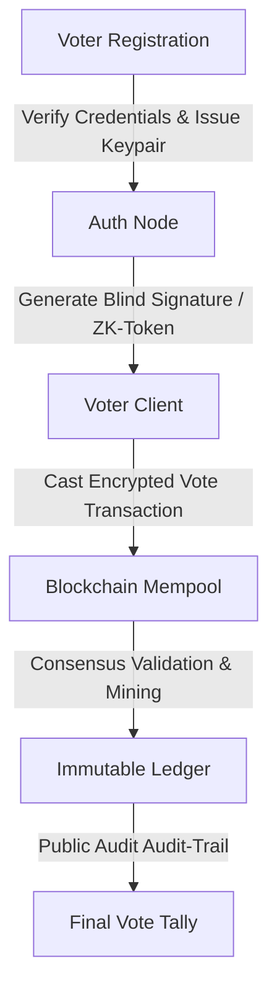

# Secured Voting Machine Using Blockchain Technology

An academic project focused on implementing a secure, decentralized, and tamper-proof electronic voting architecture leveraging Blockchain.

---

## 🎯 Project Objective

Traditional Electronic Voting Machines (EVMs) and centralized online databases face challenges regarding trust, auditability, single-point-of-failure risks, and voter coercion. This project builds a decentralized verification model that guarantees:
1. **End-to-End Verifiability:** Voters can verify that their vote was cast and counted correctly.
2. **Immutability:** Once recorded, votes cannot be modified, deleted, or re-ordered by any administrative authority.
3. **Double-Voting Prevention:** Smart contract logic ensures each registered cryptographic identity can only submit a single ballot token.
4. **Voter Anonymity:** Separation of voter identity authentication from the ballot registry to preserve constitutional anonymity.

---

## 🧱 System Architecture

The voting lifecycle consists of four primary phases:

### 1. Voter Registration (Identity Phase)
* Voters authenticate through a certified authority.
* The system issues a unique, one-time cryptographic token (or blind signature) to the voter's software client.
* The voter's link to their real-world identity is detached at this boundary to ensure privacy.

### 2. Transaction Casting (Ballot Phase)
* The voter selects a candidate.
* The client signs the transaction using their temporary cryptographic key.
* The transaction is broadcast to the peer-to-peer mempool of the voting network nodes.

### 3. Consensus & Block Assembly (Ledger Phase)
* Network nodes validate:
  - The transaction signature matches a valid, registered token.
  - The token has not already cast a ballot (double-voting check).
* Valid transactions are grouped, hashed in a Merkle Tree structure, and mined into a new block using a Proof of Authority (PoA) or Proof of Stake (PoS) consensus protocol.

### 4. Tallying & Verification (Audit Phase)
* Since the ledger is public, anyone can count the blocks and verify the final tally.
* The cryptographic hashes allow voters to confirm their block index without revealing who they voted for.

---

## 🛡️ Threat Model & Security Analysis

| Threat | Mitigation Mechanism |
| :--- | :--- |
| **Double-Voting** | Smart contract maintains a state machine tracking used voting tokens. Attempts to reuse tokens are automatically dropped by node validation. |
| **Sybil Attack (Fake Nodes)** | Proof of Authority (PoA) consensus limits block-validation nodes to pre-vetted institutional nodes (e.g., election commission, neutral observers). |
| **Data Alteration (MitM)** | Standard block structure with cryptographic hashing (SHA-256) ensures changing a past vote requires re-mining all subsequent blocks. |
| **Voter De-anonymization** | Implementation of cryptographic separation: identity tokens are verified, but the transaction record is submitted via a separate ring signature or blind token. |

---

## 🌟 Project Outcomes & Key Takeaways

* Developed a prototype blockchain ledger using Python/Solidity representing smart contract transaction flows.
* Demonstrated how distributed ledger systems can eliminate trust bottlenecks in critical national infrastructure.
* Explored tradeoffs between block finality speed, transaction validation latencies, and threat models.
